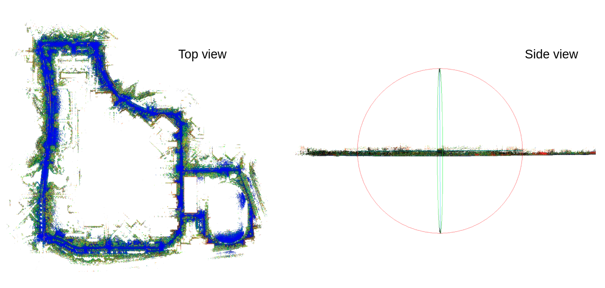
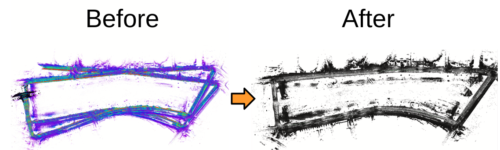

# FAST_LIO_SLAM

## News
-  ``Aug 2021``: The Livox-lidar tests and corresponding launch files will be uploaded soon. Currenty only Ouster lidar tutorial videos had been made. 

## What is FAST_LIO_SLAM?
Integration of 
1. [FAST-LIO2](https://github.com/hku-mars/FAST_LIO) (Odometry): A computationally efficient and robust LiDAR-inertial odometry (LIO) package
2. [SC-PGO](https://github.com/gisbi-kim/SC-A-LOAM) (Loop detection and Pose-graph Optimization): [Scan Context](https://github.com/irapkaist/scancontext)-based Loop detection and GTSAM-based Pose-graph optimization

## Features
- An easy-to-use plug-and-play LiDAR SLAM 
    - FAST-LIO2 and SC-PGO run separately (see below How to use? tab).
    - SC-PGO takes odometry and lidar point cloud topics from the FAST-LIO2 node. 
    - Finally, an optimized map is made within the SC-PGO node. 

## How to use?
- The below commands and the launch files are made for playing the [MulRan dataset](https://sites.google.com/view/mulran-pr/home), but applicable for livox lidars in the same way (you could easily make your own launch files).
```
    # terminal 1: run FAST-LIO2 
    mkdir -p ~/catkin_fastlio_slam/src
    cd ~/catkin_fastlio_slam/src
    git clone https://github.com/gisbi-kim/FAST_LIO_SLAM.git
    git clone https://github.com/Livox-SDK/livox_ros_driver
    cd .. 
    catkin_make
    source devel/setup.bash
    roslaunch fast_lio mapping_ouster64_mulran.launch # setting for MulRan dataset 

    # open the other terminal tab: run SC-PGO
    cd ~/catkin_fastlio_slam
    source devel/setup.bash
    roslaunch aloam_velodyne fastlio_ouster64.launch # setting for MulRan dataset 

    # open the other terminal tab
    # run file_player_mulran (for the details, refer here https://github.com/irapkaist/file_player_mulran)
```

## Utility
- We support keyframe scan saver (as in .pcd) and provide a script reconstructs a point cloud map by merging the saved scans using the optimized poses. See [here](https://github.com/gisbi-kim/FAST_LIO_SLAM/blob/bf975560741c425f71811c864af5d35aa880c797/SC-PGO/utils/python/makeMergedMap.py#L7).

## Example results 
- [Tutorial video 1](https://youtu.be/nu8j4yaBMnw) (using KAIST 03 sequence of [MulRan dataset](https://sites.google.com/view/mulran-pr/dataset))
    - Example result captures 
        <p align="center"></p>
    - [download the KAIST03 pcd map](https://www.dropbox.com/s/w599ozdg7h6215q/KAIST03.pcd?dl=0) made by FAST-LIO-SLAM, 500MB
    
- [Example Video 2](https://youtu.be/94mC05PesvQ) (Riverside 02 sequence of [MulRan dataset](https://sites.google.com/view/mulran-pr/dataset))
    - Example result captures
        <p align="center"></p>
    -  [download the Riverisde02 pcd map](https://www.dropbox.com/s/1aolth7ry4odxo4/Riverside02.pcd?dl=0) made by FAST-LIO-SLAM, 400MB

## Acknowledgements 
- Thanks for [FAST_LIO](https://github.com/hku-mars/FAST_LIO) authors.


